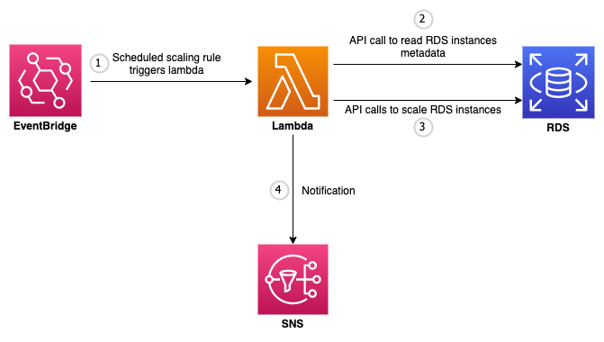

# Scheduled Scaling of RDS

Currently, AWS doesn't provide any autoscaling capability for RDS instances except for RDS Aurora. But Scheduled scaling can be implemented for RDS using Amazon EventBridge and AWS Lambda. This solutions have two stacks one for vertical scaling and other for horizontal scaling and these can be deployed independently. 

### Vertical Scaling 
Scheduled vertical scaling changes the RDS instance type, provisioned iops, storage etc. 

### Horizontal Scaling 
Scheduled horizontal scaling adds or removes the read replicas associated with RDS instances.

## Architecture


### How It Works
Each of these stacks creates two separate Amazon EventBridge rules. One triggers lambda to scale-up the resources and other triggers lambda to scale it down.

1. A scheduled EventBridge rule triggers lambda.
2. Lambda then scans each RDS instances one by one and checks for the tag `SCHEDULED_SCALING`:`ENABLED`. If this tag is found then lambda looks for tags `SCALE_DOWN_INSTANCE_CLASS`,`SCALE_UP_INSTANCE_CLASS` for vertical-scaling and `SCALE_IN_REPLICA_COUNT`,`SCALE_OUT_REPLICA_COUNT` for horizontal-scaling.
3. Lambda then make API calls to modify instances, create or delete read replica depending on which EventBridge rule is triggered and type of scaling happening.
4. SNS notification is sent containing the summary of scaling operation.

## Installation
This solution can be build either by deploying cdk stack from your environment or by using cloudformation template already synthesized.

### CDK Stack
To install using cdk stack

1. Clone this repository to your local machine.

    ```
    $ git clone https://github.com/avanishkyadav/rds-scheduled-scaling.git
    ```
   
2.  Install cdk if you don’t have it already installed.
    
    ```
    $ npm install -g aws-cdk
    ```

3.  If this is first time you are using cdk then, run cdk bootstrap.
    
    ```
    $ cdk bootstrap
    ```

4.  Make sure you in root directory.
    
    ```
    $ cd rds-scheduled-scaling
    ```
   
5.  Activate virtual environment.
    
    ```
    $ source .venv/bin/activate
    ```

6.  Install any dependencies.
    
    ```
    $ pip install -r requirements.txt
    ```

7.  List stacks. This will list out the stacks present in the project. In this case the stacks will be `rds-scheduled-horizontal-scaling` and `rds-scheduled-vertical-scaling`.
    
    ```
    $ cdk ls
    ```

8.  Synthesize cloudformation templates. The templates will be generated in `cdk.out/` directory.

    ```
    # To create vertical-scaling cloudformation template
    $ cdk synth rds-scheduled-vertical-scaling
    
    # To create horizontal-scaling cloudformation template
    $ cdk synth rds-scheduled-horizontal-scaling
    ```

9.  Deploying the stacks to create resources. List of [parameters](#stack-parameters) for each stacks.
    
    ```
    $ cdk deploy <stack-name> --parameters "<stack-name>:<parameter-name>=<parameter-value>"
    # e.g, cdk deploy rds-scheduled-horizontal-scaling --parameters "rds-scheduled-horizontal-scaling:ScaleOutTime=20 14" --parameters "rds-scheduled-horizontal-scaling:ScaleInTime=20 14"
    ```

### CloudFormation Template 
To install using cloudformation template

1. Upload file "rds-scheduled-scaling.zip" to a bucket. Tow download file click [here](https://automation-assets-avaya.s3.ap-south-1.amazonaws.com/lambda-archives/rds-scheduled-scaling.zip).
2. Create CloudFormation stack.
    - To create horizontal scaling stack, click  [here](https://automation-assets-avaya.s3.ap-south-1.amazonaws.com/cftemplates/rds-scheduled-horizontal-scaling.template.json).
    - To create vertical scaling stack, click [here](https://automation-assets-avaya.s3.ap-south-1.amazonaws.com/cftemplates/rds-scheduled-vertical-scaling.template.json).
3. Fill out parameters value. List of [parameters](#stack-parameters) for each stacks.

## Resources
Following table contains list of the primary resources created.
| Name | Type | Description |
| ----------- | ----------- | ----------- |
| rds-scheduled-horizontal-scaling-function | Lambda Function | This function performs the horizontal scaling by adding and removing read replicas. |
| rds-scheduled-vertical-scaling-function | Lambda Function | This function performs the vertical scaling by changing RDS instances class. |
| rds-scheduled-scale-out-rule | EventBridge Rule | This rule triggers `rds-scheduled-horizontal-scaling-function` to add read replicas. |
| rds-scheduled-scale-in-rule | EventBridge Rule | This rule triggers `rds-scheduled-horizontal-scaling-function` to remove read replicas. |
| rds-scheduled-scale-up-rule | EventBridge Rule | This rule triggers `rds-scheduled-vertical-scaling-function` to upgrade RDS instance class. |
| rds-scheduled-scale-down-rule | EventBridge Rule | This rule triggers `rds-scheduled-vertical-scaling-function` to downgrade RDS instance class. |

##  RDS Configuration
To implement scaling on scaling on an RDS create following tags.
| Tag Key | Tag Value | Description |
| ----------- | ----------- |
| SCHEDULED_SCALING |	ENABLED | Through this tag lambda identifies whether scheduled scaling is enabled on a databse or not|
| SCALE_UP_INSTANCE_CLASS | db.t3.xlarge, db.m5.medium etc | RDS instance class to which database or replica needs to scale up to when rule `rds-scheduled-scale-up-rule` triggers lambda `rds-scheduled-vertical-scaling-function`. |
| SCALE_DOWN_INSTANCE_CLASS | db.t3.large, db.m5.micro etc | RDS instance class to which database or replica needs to scale down to when rule `rds-scheduled-scale-down-rule` triggers lambda `rds-scheduled-vertical-scaling-function`.|
| SCALE_OUT_REPLICA_COUNT | 0-5 | Number of read replica that RDS instance have after horizontal scale out operation is finished. |
| SCALE_IN_REPLICA_COUNT | 0-5 | Number of read replica that RDS instance have after horizontal scale in operation is finished. |

## Stack Parameters
Prameters required for stack creation.
| Parameter Name | Description | Default | Remarks |
| ----------- | ----------- | ----------- | ----------- |
| BucketName |	Bucket where `rds-scheduled-scaling.zip` file is uploaded.  |  | Applicable only if installing with CDK. |
| KeyName | S3 Key name of the file `rds-scheduled-scaling.zip`. | rds-scheduled-scaling.zip | Applicable only if installing with CDK. |
| EnableNotification | Publish scaling summary to NotificationTopicArn. [yes, no] | no |  |
| NotificationTopicArn | SNS topic arn to which notification will be published. | [sns-topic-arn] |  |
| ScaleInTime | Time at which scale-in of read replicas will take place. |  | Applicable for rds-scheduled-horizontal-scaling |
| ScaleOutTime | Time at which scale-out of read replicas will take place. |  | Applicable for rds-scheduled-horizontal-scaling |
| ScaleDownTime | Time at which rds instance scales-down. |  | Applicable for rds-scheduled-vertical-scaling |
| ScaleUpTime | Time at which rds instance scales-up. |  | Applicable for rds-scheduled-vertical-scaling |

**Note -** 
- Every type of RDS instances have different constraints on number of replicas that can be created, rds instnace class allowd. So make sure a rds can be scaled to a particular instance class and replica count before creating rds scaling tags.
- Scale time parameters like `ScaleInTime`, `ScaleOutTime` etc should be in UTC timezone in the format `minute hour` and there should be no leading zero in `minute` or `hour` e.g. `14:05 UTC` will be filled out as `5 14`.
- This solution is not made to work on RDS Aurora.
- Whenever either horizontal or vertical scaling is triggered, the database enters `modifying` state and it takes around 15 minutes before it comes back to `available` state. During this period no further modification can be made to database. It is recommended  that if you are creating both rds-scheduled-horizontal-scaling and rds-scheduled-vertical-scaling stack then there should be atleast 15 minutes gap between `ScaleUpTime` and `ScaleOutTime` otherwise if both scaling are triggered at same one of them will make the changes to database sending it to `modifying` state and other scaling will skip over it because it is not in `available` state.
