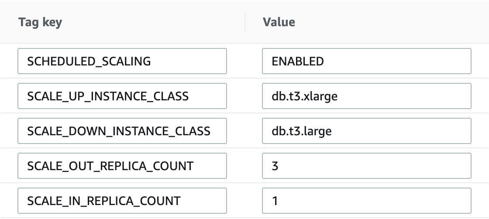

# Scheduled Scaling of RDS

Currently, AWS doesn't provide any autoscaling capability for RDS instances except for RDS Aurora. But Scheduled scaling can be implemented for RDS using Amazon EventBridge and AWS Lambda. This solutions have two stacks one for vertical scaling and other for horizontal scaling and these can be deployed independently. 

### Vertical Scaling 
Scheduled vertical scaling changes the RDS instance type, provisioned iops, storage etc. 

### Horizontal Scaling 
Scheduled horizontal scaling adds or removes the read replicas associated with RDS instances.

## Architecture


### How It Works
Each of these stacks creates two separate Amazon EventBridge rules. One triggers lambda to scale-up the resources and other triggers lambda to scale it down.

1. A scheduled EventBridge rule triggers lambda.
2. Lambda then scans each RDS instances one by one and checks for the tag `SCHEDULED_SCALING`:`ENABLED`. If this tag is found then lambda looks for tags `SCALE_DOWN_INSTANCE_CLASS`,`SCALE_UP_INSTANCE_CLASS` for vertical-scaling and `SCALE_IN_REPLICA_COUNT`,`SCALE_OUT_REPLICA_COUNT` for horizontal-scaling.
3. Lambda then make API calls to modify instances, create or delete read replica depending on EventBridge rule triggered and type of scaling happening.
      


This is a blank project for Python development with CDK.

The `cdk.json` file tells the CDK Toolkit how to execute your app.

This project is set up like a standard Python project.  The initialization
process also creates a virtualenv within this project, stored under the `.venv`
directory.  To create the virtualenv it assumes that there is a `python3`
(or `python` for Windows) executable in your path with access to the `venv`
package. If for any reason the automatic creation of the virtualenv fails,
you can create the virtualenv manually.

To manually create a virtualenv on MacOS and Linux:

```
$ python3 -m venv .venv
```

After the init process completes and the virtualenv is created, you can use the following
step to activate your virtualenv.

```
$ source .venv/bin/activate
```

If you are a Windows platform, you would activate the virtualenv like this:

```
% .venv\Scripts\activate.bat
```

Once the virtualenv is activated, you can install the required dependencies.

```
$ pip install -r requirements.txt
```

At this point you can now synthesize the CloudFormation template for this code.

```
$ cdk synth
```

To add additional dependencies, for example other CDK libraries, just add
them to your `setup.py` file and rerun the `pip install -r requirements.txt`
command.

## Useful commands

 * `cdk ls`          list all stacks in the app
 * `cdk synth`       emits the synthesized CloudFormation template
 * `cdk deploy`      deploy this stack to your default AWS account/region
 * `cdk diff`        compare deployed stack with current state
 * `cdk docs`        open CDK documentation

Enjoy!
